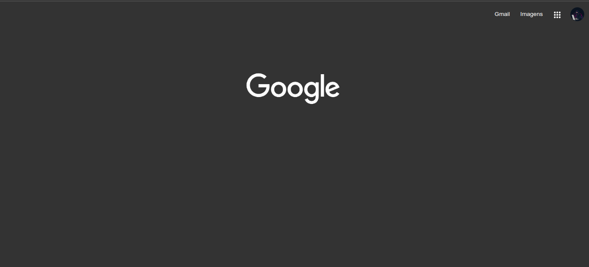
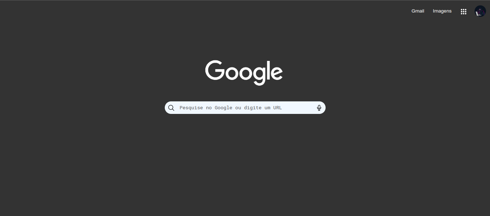

# Olá meu nome é Rafael👋👋👋.

# ===================================== 

## Clone do Google | HTML & CSS :
### Começei a programar o projeto bem simple, usando algumas cores escuras e brancas, font é a roboto(https://fonts.google.com/specimen/Roboto+Mono), a logo do google e também estou usando ionicons(https://ionic.io/ionicons) para usar os icones;

# ===================================== 

## Clone do Google | HTML & CSS | Parte 2 :
### Terminei a parte da barra de pesquisa do clone do google, logo vou deixar o site responsivo para celular e table, talvez colocar para mudar a cor de black para light, coloquei icones do ionicos na barra de pesquisa também;

# ===================================== 

### Meu Insta🌐: https://www.instagram.com/rafael.timoteo.r.h/